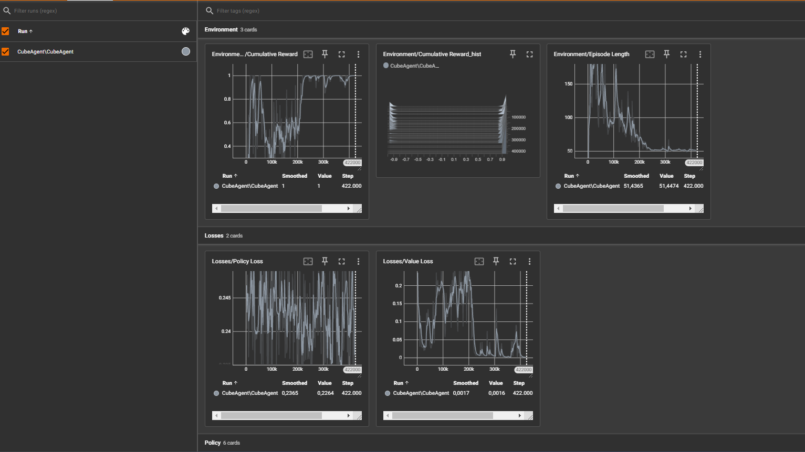

# jumper-assignment-mochiXP25
Mohammed Asad, Hafid 2ITCSC1

## Jumper-opdracht

Dit document legt uit hoe de Jumper-opdracht werkt.

### Overzicht

In dit project hebben we met behulp van machine learning een neurale netwerk gemaakt dat werd getraind om obstakels te ontwijken door eroverheen te springen. De agent werd beloond wanneer hij sprong en gestraft wanneer hij het obstakel raakte.

### Technisch

- Agent: Een kubus
- Obstakel: Een kubus
- Acties:
  - Kubus springt = beloning
  - Niet springen resulteert in straf

## Training

Uit de grafieken blijkt dat het buitengewoon lang heeft geduurd voordat de AI erin slaagde om op een correcte manier over het obstakel te springen

## Resultaat
Het heeft lang geduurd, maar het is uiteindelijk gelukt om de AI succesvol over het obstakel te laten springen.

## Naboosten van het project
1 Clone het project naar je eigen machine met git clone
2 Open unity hub
3 Open het project
4 Installeer de ml-agent package in het project
5 Zet anaconda enviroment op
6 Voer de volgende commando uit in de command line van de anaconda enviroment:mlagents-learn CubeAgent.yaml --run-id=CubeAgent
7 Om het resultaat te bekijken stop je het leerproces en voer verolgens de volgende commando uit =tensorboard --logidir 